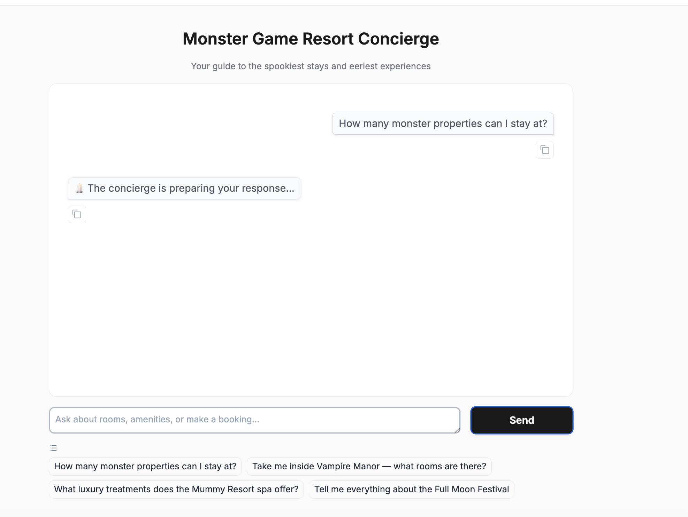
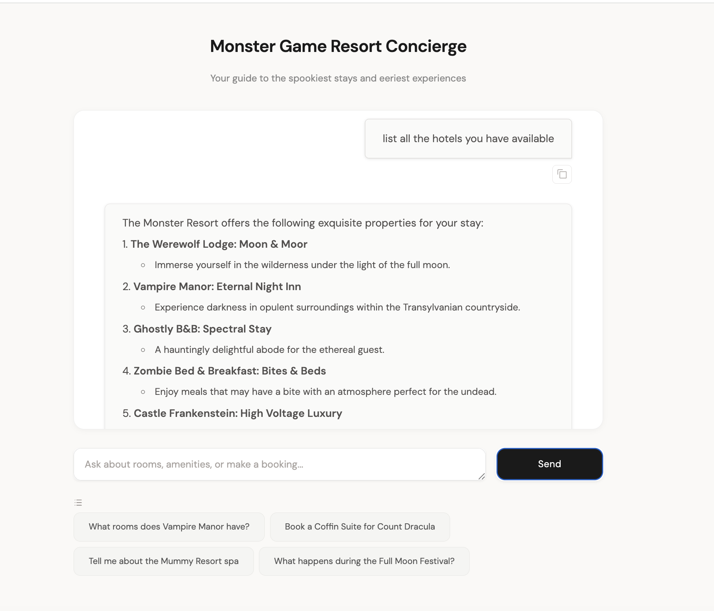

<p align="center">
  
  
  
  
  
</p>

# Monster Game Resort Concierge

A fully wired AI concierge system with hybrid RAG (BM25 + dense + cross-encoder reranking), real-time hallucination scoring, multi-provider LLM fallback, and function-calling tool execution — built to demonstrate how retrieval, agent loops, memory, monitoring, and deployment work together in a production-shaped architecture.

This isn't a wrapper around an API call. It's a complete backend: a 3-stage retrieval pipeline, an agent loop with tool calling, database-backed conversation memory with automatic summarization, hallucination detection on every response, and CI/CD to AWS — all behind JWT auth, rate limiting, and Prometheus observability.

### The 6 Resorts

- **The Mummy Resort & Tomb-Service**
- **The Werewolf Lodge: Moon & Moor**
- **Castle Frankenstein: High Voltage Luxury**
- **Vampire Manor: Eternal Night Inn**
- **Zombie Bed & Breakfast: Bites & Beds**
- **Ghostly B&B: Spectral Stay**

<p align="center">
  
</p>
<p align="center">
  
</p>

---

## Technical Highlights

- **3-stage hybrid RAG pipeline** — BM25 keyword + dense vector retrieval, fused via Reciprocal Rank Fusion, then reranked by a cross-encoder. Not a single-vector lookup.
- **Hallucination detection on every response** — token overlap + semantic similarity + source attribution scoring → HIGH / MEDIUM / LOW confidence returned with every answer.
- **3-provider LLM fallback** — OpenAI → Anthropic → Ollama. If one goes down, the next takes over automatically. No user-facing errors during provider outages.
- **Function-calling agent** — Tool registry with schema generation, input validation against a 6-property allowlist, and async execution with timing and structured logging.
- **Two-agent orchestrator (`/chat/v2`)** — Planner classifies intent (knowledge/tool/clarify/chitchat), Executor carries out the plan with structured output parsing and retry logic.
- **Database-backed conversation memory** — Messages persist across restarts. Automatic summarization at 12 messages compresses context while preserving conversational continuity.
- **Head-to-head RAG benchmark** — Custom hybrid pipeline vs LangChain RAG, tracked via MLflow. Run `uv run python scripts/benchmark_rag.py` to reproduce.
- **Full production stack** — JWT + API key auth, rate limiting, Prometheus/Grafana, ECS Fargate deployment, GitHub Actions CI/CD.

---

## What the Agent Actually Does

```
Guest: "What's the spa situation at the Mummy Resort? Asking for a friend who's been wrapped up."
Guest: "Do you have WiFi at the Ghostly B&B? I need to ghost someone on social media."
Guest: "Book me a room at Werewolf Lodge — but not during full moon, I shed everywhere."
```

1. Message is validated, sanitized, and authenticated (JWT or API key)
2. RAG pipeline runs hybrid search — BM25 keyword + dense vector retrieval — fused via Reciprocal Rank Fusion, then reranked by a cross-encoder
3. Top 5 context chunks are injected into the system prompt with source attribution tags
4. LLM (OpenAI / Anthropic / Ollama) generates a response and decides whether to call a tool
5. Tool executes: validates hotel against a 6-property allowlist, checks dates, writes to SQLite, generates a PDF receipt
6. Tool results feed back to the LLM for a synthesis response
7. Hallucination detector scores the final output (context overlap + semantic similarity + source attribution) and assigns HIGH / MEDIUM / LOW confidence
8. Response streams back to the Gradio chat UI with confidence metadata
9. Prometheus captures request latency, token usage, RAG retrieval time, and confidence distribution

**Sample `/chat` response:**

```json
{
  "response": "The Mummy Resort offers a Sand Exfoliation Treatment, Papyrus Wrap Therapy...",
  "confidence": "HIGH",
  "confidence_score": 0.87,
  "provider": "openai",
  "model": "gpt-4o",
  "session_id": "abc-123",
  "request_id": "req-456"
}
```

---

## Architecture

```
+------------------+
|   Gradio Chat    |  :7861
|   (Gothic UI)    |
+--------+---------+
         |
+--------v---------+
|    FastAPI        |  :8000
|   /chat  /metrics |
+--------+---------+
         |
+--------+--------+-----------+
|                 |            |
v                 v            v
+----------+  +----------+  +----------+
| Auth &   |  | LLM      |  | RAG      |
| Rate     |  | Router   |  | Pipeline |
| Limiting |  |          |  |          |
| - JWT    |  | - OpenAI |  | - BM25   |
| - API key|  | - Anthro |  | - Dense  |
| (SHA-256)|  | - Ollama |  | (ChromaDB|
| - SlowAPI|  | Auto-fall|  | - RRF    |
| - Input  |  |   back   |  | - Cross- |
| sanitize |  +----+-----+  |  encoder  |
+----------+       |        | reranking |
                   v        +-----+----+
         +---------+---+          |
         | Agent Loop   |<--------+
         | (tool calls) |
         +---+-----+---+
             |     |
             v     v
    +--------+  +--+------+
    | SQLite |  |   PDF   |
    |Bookings|  | Receipts|
    +--------+  +---------+
```

### Project Structure

```
app/
├── main.py                 # FastAPI app, agent loop, /chat endpoint
├── config.py               # Settings from .env (pydantic BaseSettings)
├── core/
│   ├── tools.py            # Tool registry + book_room, get_booking, search_amenities
│   ├── memory.py           # MemoryStore — DB-backed persistence + auto-summarization
│   ├── llm_providers.py    # ModelRouter — OpenAI / Anthropic / Ollama fallback
│   └── stream_client.py    # SSE streaming client
├── rag/
│   ├── advanced_rag.py     # Hybrid RAG: BM25 + dense + RRF + cross-encoder
│   ├── langchain_rag.py    # LangChain RAG (same interface, for benchmarking)
│   └── vector_rag.py       # Base vector RAG implementation
├── database/
│   └── db.py               # SQLite manager with WAL, migrations, auto-backups
├── auth/
│   ├── jwt_auth.py         # JWT + API key authentication
│   └── security.py         # Rate limiting, input sanitization
├── validation/
│   ├── hallucination.py    # Confidence scoring (overlap + semantic + attribution)
│   └── ragas_eval.py       # RAGAS evaluation framework
├── monitoring/
│   └── metrics.py          # Prometheus metrics
└── services/
    └── pdf_generator.py    # ReportLab PDF receipts
```

---

## Architecture Decisions & Trade-offs

### Why hybrid RAG instead of single-vector retrieval?

**Context:** Dense embeddings handle semantic similarity well but miss exact keyword matches — especially proper nouns like hotel names. BM25 catches those but misses semantic intent.

**Decision:** Three-stage pipeline — BM25 + dense retrieval in parallel, fused via Reciprocal Rank Fusion, then reranked by a cross-encoder (BGE).

**Trade-off:** Adds ~50ms latency per query vs single-vector search. The precision improvement justifies the cost — proper noun queries (e.g., "What does Vampire Manor offer?") went from partial matches to consistent top-1 hits. Run `uv run python scripts/benchmark_rag.py` to compare against a LangChain baseline.

### Why SQLite over Postgres?

**Context:** Single-instance deployment on ECS Fargate. Write volume is low (bookings, conversation messages). No concurrent multi-writer workload.

**Decision:** SQLite with WAL mode. Zero operational overhead, no managed database dependency, $0 cost.

**Trade-off:** Cannot horizontally scale writes. Would migrate to Postgres/RDS if scaling beyond a single task or needing concurrent writers.

### Why multi-provider fallback instead of just OpenAI?

**Context:** LLM provider outages are real. A single-provider system goes down when the provider does.

**Decision:** ModelRouter tries providers in configurable priority order (default: OpenAI → Anthropic → Ollama). Failed calls automatically route to the next provider.

**Trade-off:** Response characteristics vary across providers. The system normalizes outputs via a shared LLMMessage/LLMResponse format, but latency and quality differ. Ollama runs locally at $0 but slower.

### Why hallucination scoring instead of binary guardrails?

**Context:** Binary block/allow loses information. A response that's 80% grounded should be treated differently than one that's 30% grounded.

**Decision:** Multi-signal confidence score (token overlap + semantic similarity + source attribution) on every response, with HIGH/MEDIUM/LOW thresholds. Score is returned to the client alongside the response.

**Trade-off:** Adds computation per request. The scoring is lightweight (no additional LLM call), but it means every response carries metadata the frontend must handle.

### Why conversation summarization at 12 messages?

**Context:** Long conversations overflow the LLM context window. Sending the full history becomes expensive and eventually impossible.

**Decision:** At 12 messages, the system summarizes the oldest messages into a rolling summary (LLM-based, with regex fallback if the LLM is unavailable). Old messages are pruned. The summary persists in the database.

**Trade-off:** Summarization loses detail. The threshold of 12 balances context preservation against token cost — early enough to stay within budget, late enough to capture meaningful conversation.

---

## Quick Start

### Requirements

* Python 3.11+
* [uv](https://docs.astral.sh/uv/) (recommended) or pip
* At least one LLM provider: OpenAI API key, Anthropic API key, or local Ollama

### Setup

```sh
git clone https://github.com/AkinCodes/monster-game-resort-concierge.git
cd monster-game-resort-concierge
uv sync
cp .env.example .env   # Add your API key(s)
```

### Run

```sh
uv run uvicorn app.main:app --reload
```

* **Health Check** → http://localhost:8000/health
* **API Docs** → http://localhost:8000/docs
* **Web UI (Gradio)** → http://localhost:8000/gradio *(if enabled)*
* **Metrics** → http://localhost:8000/metrics

---

## API Endpoints

| Method | Endpoint | Description |
|--------|----------|-------------|
| `GET` | `/health` | Liveness check |
| `GET` | `/ready` | Readiness check |
| `POST` | `/login` | Get JWT access + refresh tokens |
| `POST` | `/chat` | Main chat endpoint (returns confidence scores + provider used) |
| `POST` | `/chat/stream` | Streaming chat via SSE |
| `GET` | `/tools` | List registered tools and schemas |
| `GET` | `/metrics` | Prometheus metrics |
| `POST` | `/chat/v2` | Orchestrator-based chat (plan-then-execute) |
| `POST` | `/admin/api-keys` | Create API key |
| `GET` | `/admin/api-keys` | List API keys |
| `DELETE` | `/admin/api-keys/{key_id}` | Revoke API key |
| `GET` | `/admin/api-keys/{key_id}/usage` | View key usage audit log |

### Authentication

**API Key:**
```bash
curl -H "Authorization: Bearer $MRC_API_KEY" \
  http://localhost:8000/chat \
  -d '{"message": "Book a room for Mina at Vampire Manor"}' \
  -H "Content-Type: application/json"
```

**JWT Bearer Token:**
```bash
# Login
curl -X POST http://localhost:8000/login \
  -H "Content-Type: application/json" \
  -d '{"username": "demo", "password": "demo"}'

# Use the token
curl -H "Authorization: Bearer <access_token>" \
  http://localhost:8000/chat \
  -d '{"message": "What amenities does the Werewolf Lodge offer?"}' \
  -H "Content-Type: application/json"
```

---

## Testing

18 test files (~1,460 lines) covering API endpoints, authentication, hallucination detection, RAG retrieval, LLM provider fallback, orchestrator, tool execution, MLflow tracking, and RAGAS evaluation.

```sh
uv run pytest --cov=app --cov-report=term-missing
```

| Category | Files | What's Covered |
|----------|-------|----------------|
| API & Auth | 4 | Endpoints, JWT flow, API key lifecycle, rate limiting |
| RAG Pipeline | 3 | Retrieval accuracy, LangChain parity, unit chunking |
| LLM & Agent | 2 | Provider fallback, hallucination scoring |
| Booking & Tools | 2 | Booking creation, tool registry validation |
| MLOps | 2 | MLflow experiment tracking, RAGAS evaluation |
| Infrastructure | 1 | Cache utilities |

CI runs on every push to main via GitHub Actions (lint + test + deploy).

---

## Deployment

### Docker

```sh
# Single container
docker build -t monster-game-resort-concierge .
docker run -p 8000:8000 --env-file .env monster-game-resort-concierge

# Full stack (API + Prometheus + Grafana + MLflow)
docker-compose up --build
```

### AWS (ECS Fargate)

Deployment config in `deploy/aws/`:

* **ECS Fargate** — 1 vCPU, 2GB RAM, secrets via AWS Secrets Manager
* **ECR push:** `./deploy/aws/ecr-push.sh <account-id> <region>`
* **Deploy:** `./deploy/aws/deploy.sh <account-id> <region>`
* **CI/CD:** GitHub Actions auto-deploys on push to main (OIDC-based AWS credential assumption)

---

## Configuration

All settings via `.env` (prefix: `MRC_`). See `.env.example` for the full list.

```env
MRC_LLM_PROVIDER_PRIORITY=openai,anthropic,ollama
MRC_LLM_FALLBACK_ENABLED=true
MRC_OPENAI_MODEL=gpt-4o
MRC_HALLUCINATION_HIGH_THRESHOLD=0.7
MRC_MLFLOW_ENABLED=false
MRC_ENABLE_GRADIO=false
```

---

## Known Limitations

- **SQLite** limits horizontal scaling to a single writer — would migrate to Postgres for multi-instance deployment
- **Hallucination detector** uses heuristic scoring (token overlap + semantic similarity), not a trained classifier — effective for high-confidence cases, less reliable in ambiguous ones
- **Cross-encoder reranking** adds ~50ms latency per query — a deliberate accuracy/latency trade-off
- **No prompt injection defense** beyond input sanitization — adversarial prompt attacks are not actively mitigated
- **Knowledge base is static** — no automated ingestion pipeline for new content (manual `ingest_knowledge.py`)
- **Rate limiting is global**, not per-user — all clients share the same quota

---

## Skills Demonstrated

- **LLM application architecture** — agent loops, tool calling, conversation memory, multi-provider orchestration
- **Information retrieval** — hybrid search (BM25 + dense + RRF), cross-encoder reranking, retrieval evaluation
- **MLOps** — MLflow experiment tracking, RAGAS evaluation framework, automated benchmarking
- **Production engineering** — JWT/API key auth, input sanitization, rate limiting, structured logging
- **Observability** — Prometheus metrics, Grafana dashboards, health/readiness separation
- **Cloud deployment** — Docker, AWS ECS Fargate, ECR, Secrets Manager, GitHub Actions CI/CD
- **Testing** — 18 test files (~1,460 lines) covering auth, RAG, hallucination detection, LLM fallback, orchestrator, and MLOps

---

## License

MIT — see [LICENSE](LICENSE).
